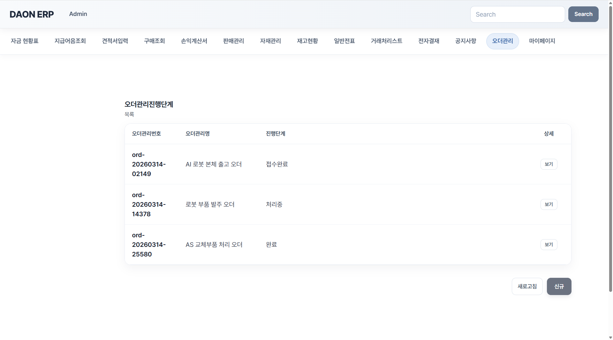
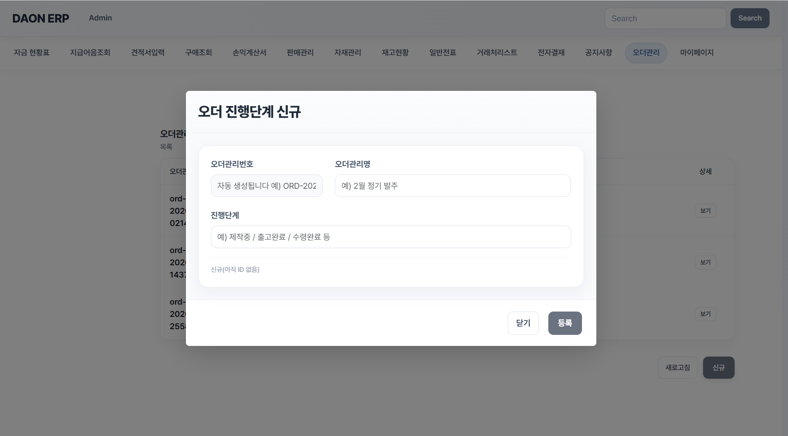
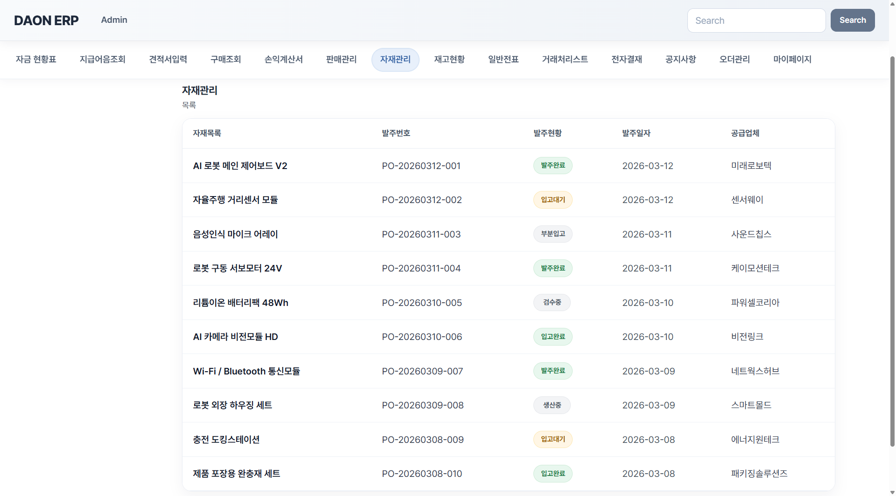
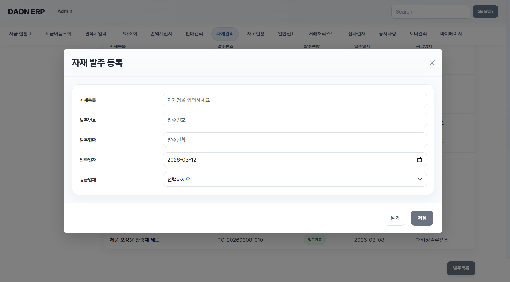
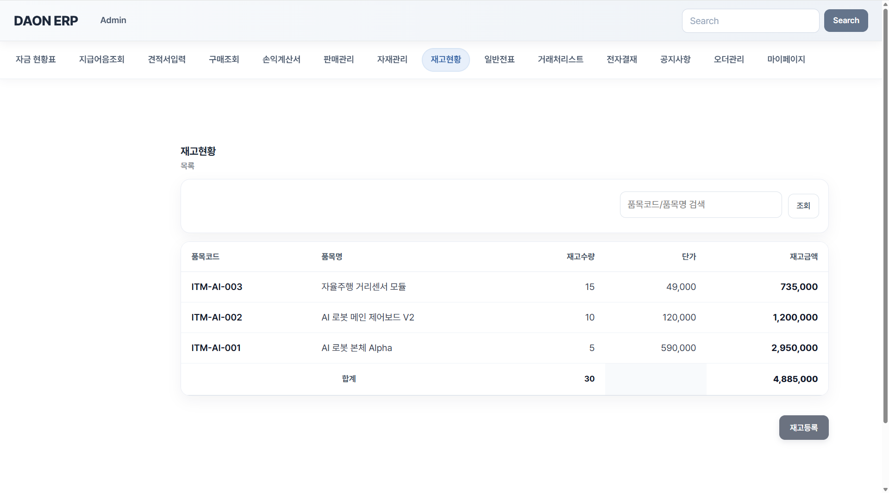
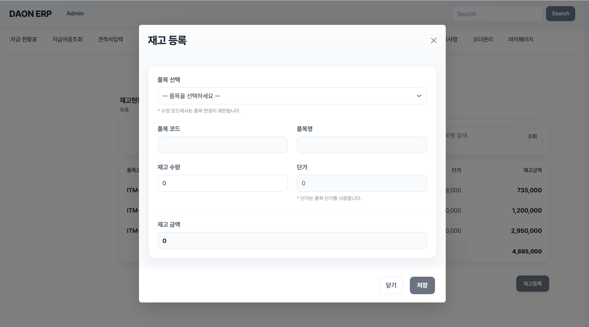

# DAON ERP – Integrated Business Management Platform (Frontend)

React + TypeScript 기반으로 개발한 **ERP 프론트엔드 프로젝트**입니다.  
사용자 인증(JWT)과 역할(Role) 기반 접근 제어를 포함하여, 주문관리, 자재관리, 재고현황 등 주요 업무 흐름을 UI로 구현했습니다.

단순 화면 구현을 넘어,  
**업무 프로세스와 권한 구조를 함께 고려한 ERP 플랫폼**을 목표로 개발했습니다.

---

## 📌 Project Overview

DAON ERP는 관리자 및 사용자 관점의 업무 흐름을 반영한  
통합 업무 관리 프론트엔드 프로젝트입니다.

프론트엔드는 React 기반으로 구현되었으며,  
JWT 인증과 역할 기반 접근 제어를 통해 실제 서비스와 유사한 구조를 설계했습니다.

### 핵심 목표
- ERP 핵심 업무 화면 구현
- JWT 기반 인증 및 권한 분리
- 주문, 자재, 재고 흐름을 고려한 UI 설계

---

## 🚀 Tech Stack

### Frontend
- **React**
- **TypeScript**
- **Vite**
- React Router DOM

### Authentication
- JWT 기반 인증 처리
- LocalStorage 토큰 관리
- Role 기반 접근 제어

### Dev Tools
- Git
- GitHub
- IntelliJ IDEA / VS Code
- Postman

---

## ✨ Main Features

### 🔐 인증 및 권한 관리
- 로그인 / 회원가입 기능
- JWT 기반 인증 처리
- LocalStorage 토큰 저장
- 보호 라우트(RequireAuth / RequireAdmin) 적용

### 📦 주문관리
- 주문 진행단계 목록 조회
- 주문관리 상세 확인
- 주문 진행단계 등록 기능

### 🏭 자재관리
- 자재 발주 목록 조회
- 발주 현황 및 공급업체 확인
- 자재 발주 등록 기능

### 📊 재고현황
- 품목별 재고 조회
- 재고 수량 및 재고 금액 확인
- 재고 등록 기능

---

## 🔄 Workflow

1. 사용자가 로그인 후 권한에 맞는 화면에 접근
2. 주문관리 화면에서 주문 진행단계를 조회 및 등록
3. 자재관리 화면에서 발주 현황을 확인하고 신규 발주 등록
4. 재고현황 화면에서 품목별 재고 수량 및 금액을 조회
5. 필요 시 재고 등록을 통해 데이터를 추가 관리

---

## 🖼 Screenshots

### 1. 오더관리
주문 진행단계 목록을 조회하고 각 주문 건의 상태를 확인할 수 있는 화면입니다.



### 2. 오더관리 등록
주문관리번호, 주문관리명, 진행단계를 입력하여 새로운 주문 진행단계를 등록하는 화면입니다.



### 3. 자재관리
자재 목록, 발주번호, 발주현황, 발주일자, 공급업체 정보를 조회할 수 있는 화면입니다.



### 4. 자재발주등록
자재명, 발주번호, 발주현황, 발주일자, 공급업체를 입력하여 신규 자재 발주를 등록하는 화면입니다.



### 5. 재고현황
품목코드, 품목명, 재고수량, 단가, 재고금액을 조회할 수 있는 화면입니다.



### 6. 재고등록
품목 선택 후 재고 수량과 재고 금액을 등록할 수 있는 화면입니다.



---

## 🛠 Getting Started

### 1. Clone repository
```bash
git clone https://github.com/Nara-Park-513/erp-frontend.git
cd erp-frontend
```

### 2. Install dependencies
```bash
npm install
```

### 3. Run development server
```bash
npm run dev
```

### 4. Open in browser
```bash
http://localhost:5173
```

---

## ⚠️ Troubleshooting

개발 과정에서 아래와 같은 이슈를 해결했습니다.

- JWT 토큰 저장 및 인증 흐름 처리
- 관리자 / 일반 사용자 권한 분리 문제 해결
- 보호 라우트 적용 및 접근 제어 구조 정리
- 페이지 라우팅 및 화면 전환 문제 해결
- 업무 흐름에 맞는 메뉴 구성 및 UI 정리

---

## 🎯 Project Purpose

- 인증 및 권한 구조를 포함한 ERP 프론트엔드 설계
- 주문 / 자재 / 재고 흐름을 고려한 업무형 UI 구현
- 실제 서비스와 유사한 보호 라우팅 구조 경험
- 향후 백엔드 API 연동을 고려한 확장 가능한 프론트엔드 구조 마련

---

## 🔮 Future Improvements

- 실제 백엔드 API 연동 고도화
- 상태 관리 라이브러리 도입
- 공통 레이아웃 및 UI 컴포넌트 모듈화
- 에러 핸들링 및 토큰 만료 처리 개선
- 업무 도메인별 기능 확장

---

## 👩‍💻 Author

DAON ERP Frontend Project
